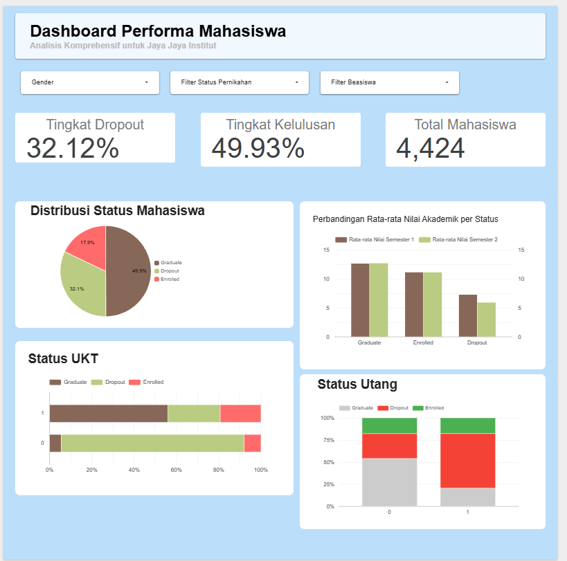
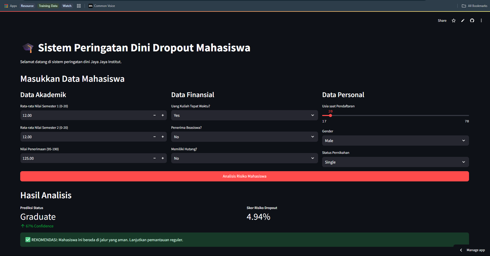

# Laporan Proyek Akhir: Prediksi Student Dropout untuk Meningkatkan Retensi di Jaya Jaya Institut

Laporan ini merangkum analisis komprehensif dan pengembangan model prediktif untuk mengatasi masalah *student dropout* di Jaya Jaya Institut. Dengan memanfaatkan data historis mahasiswa, proyek ini bertujuan untuk mengidentifikasi mahasiswa yang berisiko dan memberikan rekomendasi tindakan proaktif.

## 1\. Business Understanding

### Latar Belakang Bisnis

Jaya Jaya Institut adalah sebuah institusi pendidikan tinggi dengan reputasi yang sangat baik dan telah berdiri sejak tahun 2000. Meskipun telah mencetak banyak lulusan berkualitas, institusi ini menghadapi tantangan signifikan terkait tingginya angka mahasiswa yang tidak menyelesaikan pendidikan (dropout). Tingkat dropout yang tinggi tidak hanya berdampak pada reputasi institusi, tetapi juga pada stabilitas finansial dan moral akademik secara keseluruhan. Oleh karena itu, pihak manajemen ingin mengatasi masalah ini secara proaktif dengan memanfaatkan pendekatan berbasis data.

### Permasalahan Bisnis

Permasalahan utama yang dihadapi oleh Jaya Jaya Institut adalah sebagai berikut:

  - Tingkat *dropout* mahasiswa yang cenderung meningkat dan mengkhawatirkan.
  - Kesulitan dalam mengidentifikasi mahasiswa yang berisiko *dropout* sejak dini, yang mengakibatkan intervensi menjadi kurang efektif.
  - Ketiadaan sistem monitoring terpusat untuk memahami faktor-faktor kunci yang berkontribusi terhadap keputusan mahasiswa untuk berhenti studi.

### Cakupan Proyek

Proyek ini dirancang untuk memberikan solusi berbasis data dengan cakupan sebagai berikut:

1.  **Analisis Data Eksploratif (EDA)**: Menggali data historis mahasiswa untuk menemukan pola dan faktor-faktor yang berkorelasi dengan status *dropout*.
2.  **Pengembangan Model *Machine Learning***: Membangun dan mengevaluasi beberapa model klasifikasi untuk memprediksi probabilitas status mahasiswa (*Dropout*, *Enrolled*, atau *Graduate*).
3.  **Visualisasi Data**: Membuat *dashboard* bisnis interaktif untuk memonitor performa mahasiswa dan menganalisis faktor-faktor terkait.
4.  **Implementasi Prototipe**: Mengembangkan aplikasi web sederhana yang memungkinkan staf akademik untuk memeriksa risiko *dropout* mahasiswa secara individual.

### Persiapan

  - **Sumber Data**: Dataset yang digunakan berasal dari "Predict students' dropout and academic success," yang berisi 4424 data mahasiswa dengan 37 atribut, termasuk informasi demografis, sosioekonomi, dan akademik. Variabel target adalah kolom `Status`.
  - **Setup *Environment***: Proyek ini dikembangkan menggunakan Python dengan *library* seperti `pandas`, `numpy`, `scikit-learn`, `matplotlib`, `seaborn`, `joblib`, dan `streamlit`. Untuk mereplikasi lingkungan kerja, ikuti instruksi di bawah ini.

#### Membuat dan Mengaktifkan Virtual Environment

Instruksi ini akan membantu menciptakan lingkungan pengembangan yang terisolasi dan stabil. Pilih salah satu metode (venv atau conda).

**Opsi 1: Menggunakan `venv`**

  - **Buat sebuah virtual environment:**
    ```bash
    python -m venv venv
    ```
  - **Aktifkan virtual environment:**
      - Di Windows:
        ```bash
        .\venv\Scripts\activate
        ```
      - Di macOS/Linux:
        ```bash
        source venv/bin/activate
        ```

**Opsi 2: Menggunakan `conda`**

  - **Buat sebuah conda environment baru (misalnya, dengan nama `proyek_akhir`):**
    ```bash
    conda create --name proyek_akhir python=3.9
    ```
  - **Aktifkan conda environment:**
    ```bash
    conda activate proyek_akhir
    ```

#### Menginstal Dependensi dari `requirements.txt`

Untuk memastikan semua pustaka yang dibutuhkan tersedia, instal dependensi menggunakan `pip` setelah mengaktifkan virtual environment Anda.

  - **Jalankan perintah berikut di terminal Anda:**
    ```bash
    pip install -r requirements.txt
    ```

## 2\. Analisis Data (EDA)

Investigasi mendalam terhadap data dilakukan untuk mengungkap pola, anomali, dan hubungan antar variabel yang akan menginformasikan proses pemodelan.

  - **Pemeriksaan Struktur dan Kualitas Data**:

      - Struktur data diperiksa menggunakan `.head()` dan `.tail()`. `df.describe()` memberikan ringkasan statistik, menunjukkan bahwa rata-rata usia pendaftaran adalah 23.2 tahun.
      - Kualitas data terbukti sangat baik, dengan **0 baris duplikat** dan **tidak ada nilai yang hilang** (*missing values*), sehingga tidak memerlukan pembersihan data tambahan.

  - **Analisis Univariat**:

      - **Usia & Nilai**: Distribusi "Usia saat pendaftaran" dan "Nilai penerimaan" cenderung miring ke kanan (*right-skewed*), menunjukkan bahwa mayoritas mahasiswa mendaftar di usia muda (18-20 tahun) dengan nilai penerimaan terkonsentrasi di rentang 110-140.
      - **Keuangan & Beasiswa**: Mayoritas mahasiswa membayar uang kuliah tepat waktu dan bukan penerima beasiswa.

  - **Analisis Bivariat & Korelasi**:

      - **Nilai vs. Status**: Mahasiswa yang lulus (**Graduate**) memiliki distribusi nilai (semester 1 dan 2) yang secara signifikan lebih tinggi dibandingkan mahasiswa yang *dropout*. Kelompok *dropout* memiliki median nilai terendah, dengan banyak di antaranya memiliki nilai 0.
      - **Keuangan vs. Status**: Mahasiswa yang **tidak membayar UKT tepat waktu** (`Tuition_fees_up_to_date = 0`) atau **memiliki tunggakan** (`Debtor = 1`) menunjukkan proporsi *dropout* yang sangat tinggi, menjadikannya indikator risiko yang kuat.
      - ***Heatmap* Korelasi**: Terdapat **korelasi positif yang sangat kuat** (nilai \> 0.8) antara jumlah SKS yang disetujui, nilai akhir, dan jumlah SKS yang diambil pada semester yang sama, yang mengindikasikan adanya multikolinearitas.

## 3\. Persiapan Data

Data mentah diubah menjadi format yang dapat diproses oleh algoritma *machine learning*.

1.  **Encoding Target**: Kolom target `Status` (kategorikal) diubah menjadi format numerik (0, 1, 2) menggunakan `LabelEncoder`.
2.  **Pipeline Preprocessing**:
      - Fitur **numerik** (8 kolom) diskalakan menggunakan `StandardScaler` untuk menyamakan rentang nilai.
      - Fitur **kategorikal** (28 kolom) diubah menjadi format biner menggunakan `OneHotEncoder`.
3.  **Pembagian Data**: Dataset dibagi menjadi **3318 data latih** dan **1106 data uji**, dengan distribusi kelas yang seimbang di kedua set menggunakan `stratify`.

## 4\. Pemodelan

Tahap ini adalah inti dari proyek, di mana model prediktif dibangun dan dioptimalkan.

  - **Pemilihan dan Optimasi Model**: Model `XGBoost` dipilih untuk dioptimalkan menggunakan `GridSearchCV` guna menemukan kombinasi parameter terbaik.
  - **Hasil *Hyperparameter Tuning***:
      - Parameter terbaik yang ditemukan adalah: `learning_rate: 0.1, max_depth: 5, n_estimators: 200, subsample: 1.0`.
      - Skor *Recall Macro* terbaik dari validasi silang adalah **0.6956**, yang menjadi acuan performa model yang seimbang di semua kelas.

## 5\. Evaluasi

Model dengan performa terbaik diuji pada data yang belum pernah dilihat sebelumnya untuk menilai efektivitasnya secara objektif.

  - **Laporan Klasifikasi Final**:
      - **Akurasi Keseluruhan**: **76%**
      - **Performa per Kelas**:
          - **Dropout**: *Precision* 79%, **Recall 73%**, F1-score 76%.
          - **Graduate**: *Precision* 81%, **Recall 89%**, F1-score 85%.
          - **Enrolled**: Performa lebih rendah, yang dapat dimaklumi karena sifatnya yang transisional.

Model ini menunjukkan kemampuan yang kuat dalam mengidentifikasi mahasiswa yang lulus dan yang berisiko *dropout*.

### Analisis *Feature Importance*

Analisis ini mengidentifikasi faktor-faktor yang paling berpengaruh dalam prediksi model.

  - **Pendorong Prediksi Utama**: Kinerja akademik adalah pendorong prediksi yang paling dominan.
  - **Tiga Fitur Teratas**:
    1.  **Nilai akhir semester 2** (`Curricular_units_2nd_sem_grade`)
    2.  **Nilai akhir semester 1** (`Curricular_units_1st_sem_grade`)
    3.  **Jumlah SKS yang lulus di semester 2** (`Curricular_units_2nd_sem_approved`)
  - **Faktor Signifikan Lainnya**: Status pembayaran UKT, usia saat mendaftar, dan jumlah SKS yang lulus di semester 1.

## 6\. Solusi yang Dikembangkan

### *Business Dashboard*

Sebuah *dashboard* interaktif dibuat untuk membantu Jaya Jaya Institut memonitor performa mahasiswa dan menganalisis faktor-faktor kunci yang memengaruhi tingkat kelulusan dan *dropout*.



  - **Isi *Dashboard***:
      - **KPI Utama**: Tingkat *Dropout* (32.12%), Tingkat Kelulusan (49.93%), dan Total Mahasiswa (4.424).
      - **Distribusi Status**: Diagram pai yang menunjukkan proporsi *Graduate* (49.9%), *Dropout* (32.1%), dan *Enrolled* (17.9%).
      - **Analisis Akademik dan Keuangan**: Grafik yang membandingkan rata-rata nilai dan status pembayaran UKT di antara ketiga kelompok mahasiswa.

**Link untuk Mengakses Dashboard dengan Looker Studio:** [https://lookerstudio.google.com/reporting/9fda9bed-0922-4709-a194-65c50c82cd32](https://lookerstudio.google.com/reporting/9fda9bed-0922-4709-a194-65c50c82cd32)

-----

### Sistem *Machine Learning*

Sebagai solusi praktis, sebuah prototipe aplikasi web telah dikembangkan menggunakan Streamlit. Aplikasi ini memungkinkan staf akademik atau dosen wali untuk memasukkan data seorang mahasiswa dan mendapatkan prediksi statusnya secara instan.



**Cara Menjalankan Prototipe:**

1.  **Melalui Link Cloud (Direkomendasikan):**
    Aplikasi ini telah di-*deploy* ke Streamlit Community Cloud dan dapat diakses oleh siapa saja melalui link berikut tanpa perlu instalasi:

    **Link Aplikasi:** [https://bpdssubmission2-muexpsh6c9wvzebbgwe2ew.streamlit.app](https://bpdssubmission2-muexpsh6c9wvzebbgwe2ew.streamlit.app)

2.  **Menjalankan Secara Lokal:**
    Jika ingin menjalankan di komputer lokal, pastikan Anda sudah melakukan setup environment sesuai file `requirements.txt` lalu melakukan instalasi dengan `pip install -r requirements.txt`. Buka terminal di dalam folder proyek dan jalankan perintah berikut:

    ```bash
    streamlit run app.py
    ```

-----

## 7\. Kesimpulan dan Rekomendasi

Proyek ini berhasil mengembangkan solusi berbasis data yang dapat membantu Jaya Jaya Institut dalam mengatasi masalah *student dropout*.

### Kesimpulan Utama

1.  **Faktor Prediktor Kunci**: Kinerja akademik awal dan status keuangan adalah prediktor paling signifikan untuk *dropout*. Mahasiswa dengan nilai rendah dan masalah pembayaran UKT memiliki risiko tertinggi.
2.  **Efektivitas Model**: Model *XGBoost* yang dikembangkan memiliki akurasi 76% dan *recall* 73% untuk kelas 'Dropout', yang sangat penting untuk tujuan intervensi dini.
3.  **Usia Saat Masuk**: Mahasiswa yang lebih tua saat mendaftar menunjukkan kecenderungan *dropout* yang sedikit lebih tinggi.

### Rekomendasi Tindakan

Berdasarkan kesimpulan di atas, berikut adalah beberapa rekomendasi tindakan yang dapat segera diambil oleh Jaya Jaya Institut:

1.  **Implementasi Sistem Peringatan Dini Akademik**:
      - **Aksi**: Gunakan prototipe aplikasi prediksi untuk secara otomatis menandai mahasiswa yang mendapatkan nilai di bawah ambang batas tertentu pada semester pertama, terutama pada fitur `Curricular_units_1st_sem_grade` dan `Curricular_units_2nd_sem_grade`.
      - **Detail Teknis**: Sistem dapat diintegrasikan dengan *Learning Management System* (LMS) untuk mengirim notifikasi otomatis kepada dosen wali ketika seorang mahasiswa teridentifikasi berisiko tinggi (misalnya, probabilitas *dropout* \> 70%). Dosen wali dari mahasiswa yang ditandai wajib melakukan sesi konseling satu-satu untuk membahas tantangan belajar, memvalidasi data, dan menyusun rencana studi yang lebih personal.
2.  **Program Dukungan Keuangan Proaktif**:
      - **Aksi**: Bagian administrasi keuangan harus secara aktif menggunakan *dashboard* untuk memonitor mahasiswa yang status `Tuition_fees_up_to_date` berubah menjadi `No` atau yang status `Debtor` menjadi `Yes`.
      - **Detail Teknis**: Daripada menunggu mahasiswa menunggak, sistem dapat memicu pengiriman email atau notifikasi yang menawarkan opsi bantuan keuangan, skema cicilan yang lebih fleksibel, atau informasi beasiswa yang relevan. Analisis lebih lanjut pada *dashboard* dapat menunjukkan korelasi antara program studi tertentu dengan kesulitan finansial.
3.  **Program Mentoring dan Fleksibilitas untuk Mahasiswa Non-Tradisional**:
      - **Aksi**: Mengingat mahasiswa yang lebih tua atau yang memiliki status pernikahan berbeda (misalnya, *Married*, *Divorced*) memiliki risiko lebih tinggi, buatlah program dukungan yang lebih fleksibel.
      - **Detail Teknis**: Tawarkan program mentoring yang menghubungkan mereka dengan mahasiswa senior atau alumni berlatar belakang serupa. Selain itu, sediakan opsi kelas malam atau akhir pekan (*Daytime/evening attendance*) dan materi pembelajaran asinkron (rekaman kuliah) untuk mengakomodasi jadwal mereka yang mungkin lebih padat karena tanggung jawab keluarga atau pekerjaan.